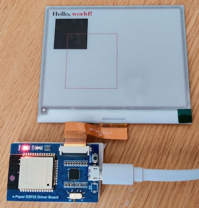

# Minimal e-paper demo with esp32 driver board

Using bitmap from u8g2 and display example code to update the e-paper display.

## PlatformIO

Useful platformio commands:

- `pio run` - process/build project from the current directory
- `pio run --target upload` or `pio run -t upload` - upload firmware to a target
- `pio run --target clean` - clean project (remove compiled files)
